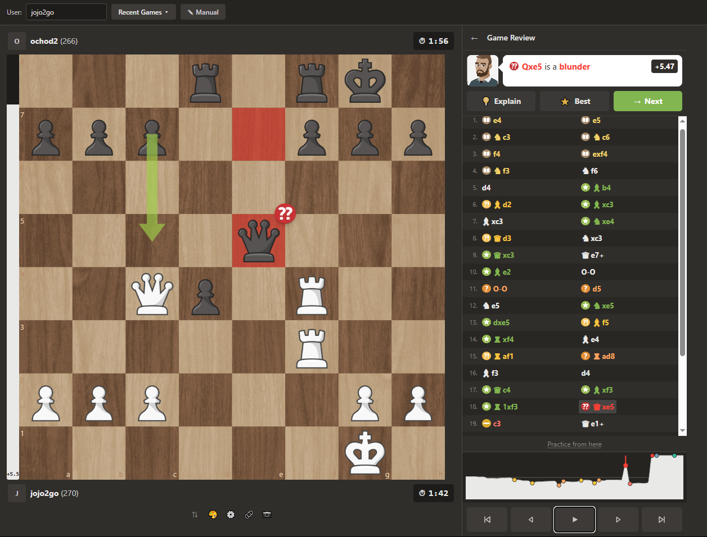
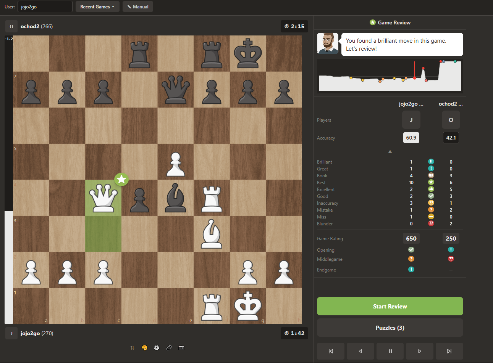

# Chess Game Review

A tool that analyzes your chess games — similar to chess.com's "Game Review" feature. It shows you which moves were good, which were bad, where you went wrong, and how to improve.

<p align="center">
  
</p>

<p align="center">
  
</p>

---

## Guide: Getting the tool running

You don't need any programming knowledge — just follow these steps in order.

### Step 1 — Install a small helper program (Node.js)

The tool runs on your computer and needs a free helper program called **Node.js**.

1. Open [nodejs.org](https://nodejs.org)
2. Download the version labeled **"LTS"** (this is the recommended, stable version)
3. Install it like any other program (just click "Next")

### Step 2 — Download the project

Download this project folder (e.g. via the green "Code" button on GitHub → "Download ZIP") and unzip it anywhere on your computer.

### Step 3 — Start the tool

1. Open the unzipped folder
2. Open a terminal window inside it (right-click in the folder → "Open Terminal here" / "Open in Terminal")
3. Type the following command and press Enter — this downloads everything the tool needs, once:
   ```
   npm install
   ```
4. Then start the tool with:
   ```
   npm run dev
   ```
5. An address like `http://localhost:5173` will appear — open it in your browser

The tool is now running locally on your machine. You can paste a game as PGN (that's the text export of a chess game) and the analysis starts automatically.

> Once you're done, just close the terminal window to stop the tool.

### Step 4 (optional) — Load games directly from chess.com

If you don't want to copy games manually, there's a small browser extension that adds an "Analyze" button directly to chess.com.

1. Open `chrome://extensions` in Chrome
2. Turn on **"Developer mode"** in the top right
3. Click **"Load unpacked"** and select the `extension/` folder from this project
4. Important: the tool from Step 3 must still be running
5. Open any game on chess.com and click the new extension icon — the game opens automatically in the analysis tool

There's also an even simpler option without an extension: a so-called **bookmarklet** (a bookmark with built-in functionality). Details in [`extension/README.md`](extension/README.md).

---

## What you'll see in the analysis

- **Move ratings** — every move gets a label like Best, Good, Inaccuracy, Mistake, or Blunder
- **Evaluation graph** — a chart showing when the game swung in whose favor
- **Accuracy %** — how precisely each side played overall
- **Opening recognition** — which known opening was played
- **Coaching explanations** *(optional)* — short, plain-language explanations of individual moves

---

## For developers

<details>
<summary>Show technical details</summary>

### Tech Stack

- **Frontend:** React 19 with TypeScript, built with Vite
- **Board:** react-chessboard
- **Chess logic:** chess.js (move validation, PGN parsing)
- **Engine:** Stockfish 18 (WebAssembly, runs in a Web Worker)
- **Charts:** Recharts
- **Styling:** Tailwind CSS
- **Tests:** Vitest

### Architecture

Three strictly separated layers:

1. **Engine layer** — Stockfish WASM evaluates positions deterministically, no LLM involved
2. **UI layer** — React components for board, evaluation, graphs, move list
3. **Coaching layer (optional)** — Claude API explains the engine's numbers in natural language, but doesn't evaluate itself

### Useful commands

```bash
npm run dev     # start dev server
npm run build   # create production build
npm run lint    # run linter
npm test        # run tests
```

### Project structure

```
├── src/
│   ├── components/        # React components (board, eval, coaching, ...)
│   ├── lib/
│   │   ├── analysis/      # Analysis logic (classification, accuracy)
│   │   └── engine/        # Engine communication and Web Worker
│   ├── hooks/             # Custom hooks (useGame, useCoaching)
│   ├── data/               # Static data (openings database)
│   ├── App.tsx
│   └── main.tsx
├── public/
│   ├── engine/             # Stockfish WASM files
│   ├── pieces/             # Chess piece SVGs
│   ├── sounds/             # Move sounds
│   └── marks/              # Classification icons
├── extension/               # Browser extension
├── Board&Game/              # Design assets
└── package.json
```

### Keyboard shortcuts

- **Left/Right arrow keys** — navigate between moves
- **Home/End** — jump to start/end of game

### Resources

- [Stockfish Documentation](https://stockfishchess.org/)
- [chess.js Documentation](https://github.com/jhlywa/chess.js)
- [React Documentation](https://react.dev/)
- [Tailwind CSS Documentation](https://tailwindcss.com/)
- [Lichess Opening Database](https://github.com/lichess-org/chess-openings)

</details>

---

## Contributing

This is a personal learning project. Feel free to fork it and adapt it for your own use!

## License

MIT
